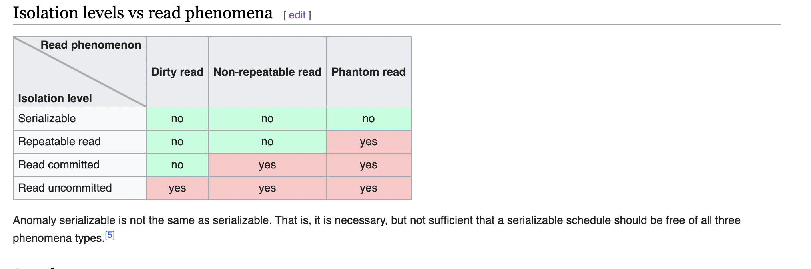

# ACID

# Atomicity

**One of the four atomic properties **

*it defines any type of databse systems*

> all queries in a transaction should succeed, 

- All queries in a transaction must succeed
  - back when atomicity principle was invented, at that point in time, an atom was supposed to be the smallest entity it couldn't be break down into smaller entities
- if one query fails, than all prior successfull queries in the transaction should rollback
- if the database went down prior to a commit of a transaction, all the successfull queries in the transaction should rollback

> now some things to wonder about databases what it is actually doing like when a transaction fails, does it goes to the disk and erase all the committed transactions... ?

##### Lets look at an example

| Account_id    | Balance       |
| ------------- |:-------------:|
| 1             | $1000         | 
| 2             | $500          |   

1. we have a account balance table where there are two accounts with some balance , we are going to move $100 from account 1 to 2
2. for that we are going to start a transaction
    
    Transaction BEGIN
         |   
         | SELECT BALANCE WHERE ACCOUNT_ID=1 
         | BALANCE > 100
         |                 MINUS 100 FROM 1000 FOR ACCOUNT_ID = 1
         |                 ADD 100 TO ACCOUNT_ID = 2
         |
   Transaction END
   
3. After the transaction ended the table looks somewhat like this

| Account_id    | Balance       |
| ------------- |:-------------:|
| 1             | $900          | 
| 2             | $600          |  

4. Now suppose while the deduction was going on, either one of the query fails or the data base crashes, the **ROLLBACK** has to happen
5. now suppose after crashing we decided to restart the machine, then what... well, after we restarted the machine the first account has been debited but the second account has not been credited yet.
6. This is really bad as we just *lost the data* , and the information is **inconsistent ** 
7. See now, an **Atom Transaction** is a transaction that will rollback all queries if one or more queries fails.
8. rollback can take more than 1 hour for long transactions like for sql server.
9. Now while rollback all the shit that was there has to be cleaned like above all the queries return, which in return makes the cpu and the memories getting hammered.
10. so longer transaction can be long
11. atomicity says that it has to be single operation that can not be split
12. if we have a transaction having 100 queris all the query has to be success, if any one of the fails ROLLBACK has to happen.

     

# Isolation
- this one is really the important property of acid. 
- lets think to answer this following question -> 

> Can my inflight transaction see the changes made by other transaction.

- lets jot down some points
- concurrency 
- multiple transactions fighting each other to read or write over some allocated resources (same piece of data)
- that is where the isolation cames in , and we ask us the above question again.
- now conside a transaction that does a commit, so another transaction if driving on the same resource, should see that commit or not, well it depends, do you want to see that change?
- there is no right and wrong, this result in something called **Read Phenomenas**, this is really undesirable and should be avoided, and this is one of the nastiest thing to debug.
- to solve the above issue **Isolation Levels** were introduced to solve the above undesirable read phenomena

#### *Isolation Read phenomenas -> *

## Dirty Reads
   - when an inflight transaction that is currently running, it read something, that some other transaction has wrote and didnt has commited something yet. so there is a chances that this change that we read could be rollbacked or it could be committed, or the database crashed.
   - so dirty read is nothing but that when you wrote something that is not **fully flushed, not fully committed**

## Non-Repeated Reads
   - Suppose you are in a transaction and then you read a value, then again in the same transaction you read that same value again. now why would you ever do the same thing twice? ... this is not required, but this happens all the time.
   - like different queries resulting in the same value.
     - like a query read some value
     - then another query is doing sum on those values, in this case again this query will read all the values that the previous query already read.
   - now what if we read something at time t1, than again at time t2, but from time t1 -> t2 the value changes. then what fucktard! 
   - that is called **non-repeatable**. ... some people call this undesirable

## Phantom Reads
   - these are things that we cant read because these are *not existing yet*, example are *range queries* .
   - like we have a **start** and **end**, we used that we got some values, now later on in the **same range**  a new row is added that satisifies the above range, now this is not non-repeated, 
   - now if we do another select,, then we are going to get that *phantom new row* and then you read, and things that can go really wrong.
   - like first time you got something and then the second something entirely else.
   - this seems like non-repeated reads but its not, because we didn't read it actually, we can't catch it

## Lost updates
  - i wrote something but before i commit, i tried to read what i wrote, well this is very common , because we are in our own bubble that is we can read something that we wrote.  
  - Now lets consider an example where 
    - one transaction starts and reads something for example a = 10, then does some computation and then stores the result
    - now consider if there is another transaction started just along with the previous one, it also did some computation on a = 10 , and then it commits.
    - this resulted in the change getting lost , done by the first transaction. this is called as lost updates.
 

# Isolation - Isolation Levels for inflight transactions

- **Read Uncommited** : No isolation, any change from the outside is visible to the transaction, committed or not.

- **Read Commited** : Each query in a transaction only sees committed changes by other transactions.
  - this is bad for long running transactions (*read why?*)
  - this is one of the most used isolation levels by various databases out there.

- **Repeatable Read** : The transaction will make sure that when a query reads a row, that row will remain unchanged while its running.
  - this does not lets us get rid of phantom read.
  - Postgres repeatable read is just like snapshot isolation, everything is versioned.

- **Snapshot** : Each query in a transaction only sees changes that have been committed up to the start of the transaction, (*its like a snapshot at the very start, the is guaranteed to solve all the issues caused by all the types of Read phenomenas*). its like a snapshot version of the database at that moment.

- **Serializable** : Transactions are run as if they serialized one after the other.
  - this is the slowest way , that is there is no concurrency.

- **Each DBMS implements isolation differently**

- Table from this course => 

| Isolation Level | Dirty Reads   | Lost updates  | Non-repeatable Reads | Phantoms   |
| -------------   |:-------------:|:-------------:|:--------------------:|:----------:|
| Read Uncommitted| may occur     | may occur     | may occur            | may occur  |
| Read Committed  | don't occur   | may occur     | may occur            | may occur  |
| Repeatable Read | don't occur   | don't occur   | don't occur          | may occur  |
| Serializable    | don't occur   | don't occur   | don't occur          | don't occur|
| Snapshot        | don't occur   | don't occur   | don't occur          | don't occur|

- keep in mind that serialzable and snapshot is different. serilizable is too slow. whereas snapshot takes a version of the db at start, this is not a backup, because it has to be done in a optimized way.

## Database Implementation of Isolation
- Each DBMS implements isolation level differently
- Pessimistic - Row level locks, Table locks, page locks to avoid lost updates
  - table locks are very very expensive
  - escalating from row to table lock, make all the running transactions pending. that were using that table or row. 
  - here lock management is very expensive, well how are we going to know whether which row or table is locked or not, there is some management that takes care of it. we have to keep track in memory.

- Optimistic - No locks, just track if things changed and fail that transaction if so.
    - lot of people prefer this over pessimistic approach.
    - and if transactions start stepping on each other, *boom we are going to fail the transaction*. and the user has to retry, 

- Repeatable read "locks" the rows it reads but it could be expensive if you read a lot of rows, postgres implements RR as snapshot. That is why you dont get phantom reads with postgres in repeatable read.
- Serializable are usually implemented with optimistic concurrency control, you can implement it pessimistically with SELECT FOR UPDATE.
  - if we go with serializable that is one after the other, which makes the database so slow.